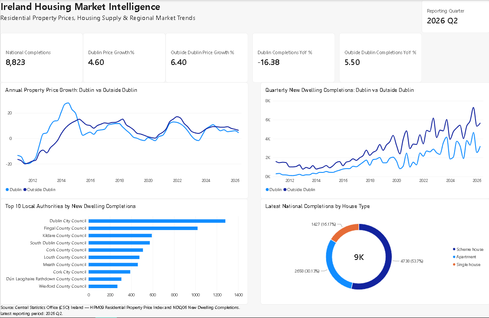

# Ireland Housing Market Intelligence

**Python | pandas | CSO PxStat | Housing Analytics | Power BI | Data Storytelling**

## Project Overview

This portfolio project analyses Ireland's residential housing market using official Central Statistics Office (CSO) datasets. It combines residential property-price trends with new dwelling completions to examine how prices and housing supply have evolved over time, how Dublin differs from the rest of Ireland, and which local authorities are currently delivering the most new housing.

The workflow demonstrates an end-to-end analytics process:

**Official CSO data → Python profiling and cleaning → validated analytical datasets → exploratory analysis → Power BI dashboard → business interpretation**

## Business Question

> How have Irish residential property prices and housing supply changed over time, how do Dublin and the rest of Ireland differ, and what recent market-pressure patterns can be observed from price growth and housing completions?

## Data Sources

### HPM09 — Residential Property Price Index

- Source: Central Statistics Office (CSO) PxStat
- Frequency: Monthly
- Downloaded coverage: **January 2005 to June 2026**
- Rows: **20,640**
- Measures include the Residential Property Price Index and 1-month, 3-month and 12-month percentage changes.
- Geographic/property groupings include National, Dublin, National excluding Dublin and selected regional/property-type indices.

### NDQ06 — New Dwelling Completions

- Source: Central Statistics Office (CSO) PxStat
- Frequency: Quarterly
- Downloaded coverage: **2011 Q1 to 2026 Q2**
- Rows: **7,936**
- Housing types: Single house, Scheme house, Apartment and All house types.
- Geography: **31 local authorities plus Ireland total**.

## Data Quality & Preparation

Python was used to profile, clean and validate both sources.

- HPM09 contained **2,960 missing `VALUE` observations**. These were preserved as missing rather than imputed as zero.
- NDQ06 contained **no missing values**.
- Both datasets contained **zero duplicate rows** and zero duplicate logical observation keys.
- Monthly and quarterly text fields were converted into analysis-ready date fields.
- Standardised column names and derived year/quarter fields were created.
- A quarterly market-intelligence dataset was built by aligning quarter-end annual price growth with housing-completion data.

## Key Findings

### Latest market position — 2026 Q2

- **8,823** new dwellings were completed nationally.
- Dublin residential property prices were up **4.6% year-on-year**.
- Prices outside Dublin were up **6.4% year-on-year**.
- Dublin recorded **3,180** completions, down **16.38% year-on-year**.
- Outside Dublin recorded **5,643** completions, up **5.50% year-on-year**.

### Housing type mix — 2026 Q2

- Scheme houses: **4,738 (53.70%)**
- Apartments: **2,658 (30.13%)**
- Single houses: **1,427 (16.17%)**

### Local authority delivery — 2026 Q2

The largest individual contributors were **Dublin City Council (1,280)** and **Fingal County Council (1,020)**, followed by Kildare, South Dublin and Cork County.

### Long-term price cycle

Dublin displayed much greater volatility during the post-crisis recovery. Annual Dublin price growth reached approximately **27.9% in September 2014**, while the sharpest annual contraction in the selected headline series was approximately **-28.1% in June 2009**.

### Interpretation

The latest data does not support a simple claim that lower housing completions automatically produce higher price growth. In 2026 Q2, Dublin completions fell sharply year-on-year while Dublin price growth was still weaker than outside Dublin. Outside Dublin recorded both stronger price growth and positive completion growth. These are descriptive market patterns and should not be interpreted as causal relationships.

## Power BI Dashboard



The final dashboard includes:

- Latest reporting quarter
- National completions KPI
- Dublin vs outside-Dublin annual price-growth KPIs
- Dublin vs outside-Dublin completion-growth KPIs
- Annual property-price growth trend
- Quarterly dwelling-completions trend
- Top 10 local authorities by latest-quarter completions
- Latest national completions by house type

The dashboard was validated against the Python outputs before finalisation.

## Repository Structure

```text
ireland-housing-market-intelligence/
├── README.md
├── .gitignore
├── requirements.txt
├── data/
│   └── README.md
├── src/
│   ├── 01_profile_datasets.py
│   ├── 02_clean_datasets.py
│   ├── 03_price_trend_analysis.py
│   ├── 04_housing_supply_analysis.py
│   ├── 05_build_market_intelligence.py
│   ├── 06_price_growth_chart.py
│   ├── 07_housing_supply_chart.py
│   └── 08_power_bi_exports.py
├── docs/
│   ├── project_plan.md
│   ├── validated_findings.md
│   └── methodology_and_limitations.md
├── dashboard/
│   └── README.md
└── images/
    ├── README.md
    └── ireland_housing_dashboard.png.png
```

## Tools & Skills Demonstrated

- **Python / pandas** — profiling, cleaning, validation and transformation
- **Data quality** — missing-value handling, duplicate-key checks and source validation
- **Time-series analysis** — monthly and quarterly market trends
- **Data modelling** — integration of price and supply datasets at a common quarterly grain
- **Power BI / DAX** — KPI measures, time-series visuals, ranking and composition analysis
- **Business analysis** — translating public housing statistics into clear, defensible market insights
- **GitHub** — reproducible documentation and version control

## Important Scope Notes

HPM09 and NDQ06 operate at different geographic levels. HPM09 provides national, Dublin, National excluding Dublin and selected regional/property-type price indices, while NDQ06 provides completions by local authority. Therefore, this project does **not** present a county-by-county property-price ranking.

Absolute completion counts should not be interpreted as per-capita housing-delivery performance. Any relationship between price growth and housing supply is presented as descriptive association only, not causation.

## Project Status

✅ **Complete — Python analysis, validated market-intelligence dataset and Power BI dashboard completed.**

## Author

**Antony Pereira George**  
Dublin, Ireland  
Data Analyst | SQL | Python | Power BI

---

*This project uses official public CSO datasets and is intended for educational and portfolio purposes.*
